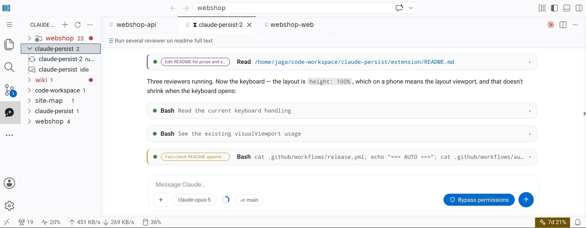

<p align="center">
  
</p>

<h1 align="center">Claude Persist</h1>

<p align="center">
  Persistent Claude Code sessions for VS Code and code-server.<br>
  Refresh the browser, close the laptop, come back on your phone —<br>
  the session keeps running on the server and the chat picks up where it left off.
</p>

<p align="center">
  <a href="https://open-vsx.org/extension/jaga/claude-persist-vscode"></a>
  <a href="https://marketplace.visualstudio.com/items?itemName=jaga.claude-persist-vscode"></a>
  <a href="https://github.com/jagajaga/claude-persist/releases"></a>
  <a href="https://github.com/jagajaga/claude-persist/actions/workflows/auto-release.yml"></a>
  
</p>

---

**Install:** search **Claude Persist** in the Extensions view, or from
[the VS Code Marketplace](https://marketplace.visualstudio.com/items?itemName=jaga.claude-persist-vscode)
and [Open VSX](https://open-vsx.org/extension/jaga/claude-persist-vscode).
Your editor picks the build for its platform. The
[listing](https://marketplace.visualstudio.com/items?itemName=jaga.claude-persist-vscode)
has the feature list, requirements, settings and first-run steps; this file is
about how it works and how to hack on it.

This is a community project. It is not affiliated with, or endorsed by,
Anthropic.



## Why

A VS Code extension's processes die with the extension host. In code-server
that host restarts on every page refresh, which is why the official Claude Code
extension loses a live session when you reload
([anthropics/claude-code#36845](https://github.com/anthropics/claude-code/issues/36845)).
Desktop VS Code restarts it too, just less often: on reload, on an extension
update, on a crash.

VS Code solved this for terminals by moving them out of the extension host and
into a process that outlives it. Claude Persist does the same for Claude
sessions: the conversation lives in a daemon, and every window is a disposable
view onto it.

```
browser tab           server
┌───────────────┐   ┌─────────────────────────────────┐
│ webview tabs  │   │  extension host (thin client)   │
│ (disposable)  │◄─►│             │                   │
└───────────────┘   │      Unix socket, or a named    │
                    │      pipe on Windows            │
                    │             ▼                   │
                    │  claude-persist daemon          │
                    │    └─ Claude Agent SDK query()  │
                    └─────────────────────────────────┘
                      owns the sessions and survives
                      everything except the server
```

Every chat event is sequence-numbered and appended to
`~/.claude-persist/sessions/<id>.jsonl`, rotated into `<id>.jsonl.<n>` archives
as it grows. A client attaches with the last sequence number it saw and gets a
replay of what it missed — turns that finished, and permission prompts still
waiting, while nobody was connected. A turn interrupted by a restart or a rate
limit is written to `<id>.pending.json` and re-armed when the daemon comes back.

Only one daemon may run per user. It takes a pid lock, verifies that whoever
holds it is actually serving, and takes over if not. It also watches its own
socket: if an older build unlinks it during an upgrade, it rebinds rather than
staying alive and unreachable.

## What it does

The [marketplace listing](https://marketplace.visualstudio.com/items?itemName=jaga.claude-persist-vscode)
has the full list. In short: reload-proof sessions as editor tabs, a chat with
tool cards, diffs, permissions and questions, image and file attachments,
several Claude accounts with automatic rotation and resume when one hits its
rate limit, subagent tracking with per-message attribution, and a UI that works
on a phone.

## Questions people ask

**Where does the daemon run?** On whatever machine the extension host runs on.
Locally that is your machine; over Remote-SSH, in a devcontainer, in Codespaces
or in code-server it is the remote, which is also where your files and your
Claude Code login are. That is the arrangement this is built for.

**Does it clash with the official Claude Code extension?** No. They share
nothing but your login, and both can be installed. This one does not replace
Claude Code; it drives it.

**Does my existing Claude Code setup apply?** Yes. Sessions run through the
Claude Agent SDK with your own configuration directory, so your `CLAUDE.md`,
skills, MCP servers, hooks and permission settings are the ones in effect. No
prompt or tool policy is injected on top, beyond the permission mode you pick in
the panel.

**Which models can I choose?** Whatever the SDK reports for your account, which
is queried rather than hardcoded. `claudePersist.extraModels` adds ids the list
does not include.

**Do sessions survive a server reboot?** The conversation does: it is on disk in
`~/.claude-persist/sessions/`. A turn that was mid-flight is re-sent when the
daemon comes back. The daemon itself starts again with the first window that
asks for it, or at boot if you install the systemd unit below.

**How do I stop it?** Uninstalling the extension leaves the daemon running until
the machine restarts, because it is deliberately not a child of VS Code. Stop it
with `pkill -f 'claude-persist.*daemon/dist/main.js'`, and delete
`~/.claude-persist/` to remove the conversations.

## Build from source

```bash
npm install
npm run build          # tsc for shared, daemon and extension
npm test               # 226 daemon + 221 extension tests
./scripts/package.sh   # -> claude-persist-<version>.vsix, no bundled runtime
```

Node 18 or newer; CI builds and tests on 20 and 22. To run against a checkout
rather than the bundled daemon, point `claudePersist.daemonEntry` at
`daemon/dist/main.js`.

### Repo layout

| Path | What it is |
|---|---|
| `daemon/` | Session daemon: Agent SDK sessions, the newline-delimited JSON socket protocol, event log, permission bridge, accounts and rotation, transcript importer |
| `extension/` | VS Code extension: daemon client, chat webview (`media/`), sidebar tree, panel serializer |
| `shared/` | Wire protocol types and the version constant, shared by both |
| `scripts/package.sh` | Builds a `.vsix`, optionally with a platform runtime |
| `scripts/changelog.sh` | Regenerates `extension/CHANGELOG.md` from tags |
| `scripts/publish-ovsx.sh` | Manual Open VSX publish, for when CI could not |
| `scripts/fix-mobile-keyboard.sh` | Patches code-server for Android keyboards |

### Packaging a .vsix

`CP_TARGET` names the platform and selects the matching Claude Code runtime.
Leaving it empty produces the build with no runtime, which drives whatever
Claude Code is already installed:

```bash
CP_TARGET=darwin-arm64 ./scripts/package.sh   # bundles the macOS arm64 runtime
CP_SDK_PLATFORMS=none  ./scripts/package.sh   # no runtime, about 1 MB
```

The runtime ships as one npm package per platform and npm installs only the
host's, so a bundled build has to be packaged on the platform it targets. The
release workflow does exactly that: one runner per target — `linux-x64`,
`linux-arm64`, `darwin-x64`, `darwin-arm64`, `win32-x64` — plus the
runtime-less build, published to both registries. It runs on every push to
main that touches code, and a separate daily job bumps the Agent SDK.

## Running it

The daemon starts itself, detached from VS Code, and replaces itself when the
extension updates. Nothing needs to be installed or supervised.

An upgrade that only changes the daemon's build waits until no session is
running before swapping, so a turn in progress is not thrown away for it; one
that changes the wire protocol cannot wait, since nothing could talk to the old
daemon in the meantime.

- **Logs:** `~/.claude-persist/daemon.log`
- **State:** `~/.claude-persist/` — sessions, uploads, the session registry,
  the active-account choice
- **Logins:** `~/.claude` and `~/.claude-accounts`, which are separate, so
  clearing state does not sign you out

### Security

The daemon listens on a socket in your home directory, mode 0600, and one
process serves every window for your user. Chat transcripts are written to disk
unencrypted, including anything you paste into a conversation — redaction is on
the roadmap, not in the product.

### Mobile (Android) keyboard

The chat resizes itself to whatever the on-screen keyboard leaves visible, but
only if the platform says what that is. Android browsers overlay the keyboard on
code-server's fixed-position workbench (`resizes-visual` by default) and Firefox
does not report the change to a nested frame at all, so from inside the panel
there is nothing to measure and nothing that can compensate for it.

Run this once on the server, and again after each code-server upgrade:

```bash
./scripts/fix-mobile-keyboard.sh
```

It adds `interactive-widget=resizes-content` to code-server's viewport meta, so
the keyboard shrinks the layout viewport and the whole workbench — editors,
terminals and this extension's composer — stays above it. Hard-reload the
browser afterwards; the HTML is cached.

### Optional: daemon under systemd

The daemon is self-spawning, but a user unit brings it back after a reboot.
Sessions themselves are on disk and survive regardless; this only saves the
first window from starting it.

```ini
# ~/.config/systemd/user/claude-persist.service
[Unit]
Description=claude-persist session daemon
[Service]
ExecStart=/usr/bin/node /path/to/claude-persist/daemon/dist/main.js
Restart=on-failure
[Install]
WantedBy=default.target
```

## Roadmap

Slash-command autocomplete, "always allow" permission rules, native
diff-editor integration, AI titles for imported sessions, and redaction of
secrets pasted into the chat.

## License

MIT
